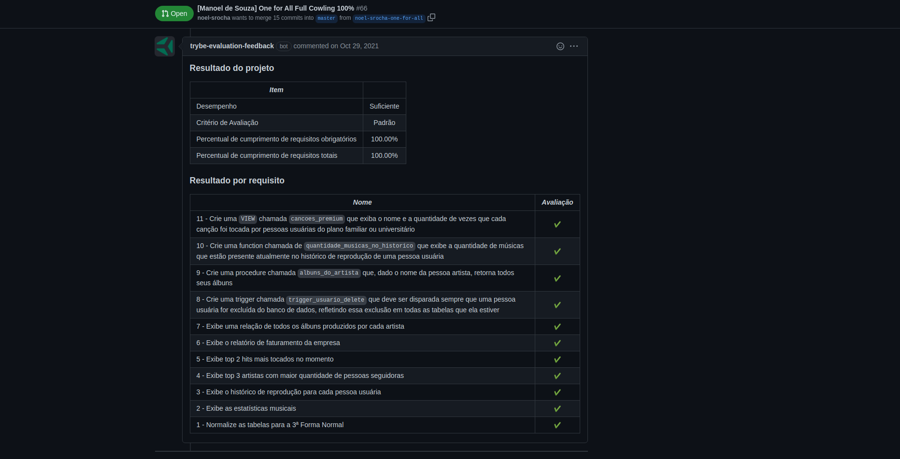

### The Assignment

Today, in the ***One For All*** project, you will use **one** table to review and consolidate **all** the main concepts seen so far.

You will receive a non-normalized table, which must be normalized and populated, so that you can run queries on it in order to find the requested information.

### Skills to be Tested

In this project, I was able to:

  * Model a database

  * Identify entities, attributes and relationships
  
  * Apply 1st, 2nd and 3rd Normal Form

  * Create tables
  
  * Handle VIEWs

  * Change existing tables

  * Create dynamic reactions with TRIGGERS

### Evaluator Results

#### Disclaimer

This was an assignment developed by [Trybe](https://www.trybe.com) in order to test my skills with MySQL technologies.